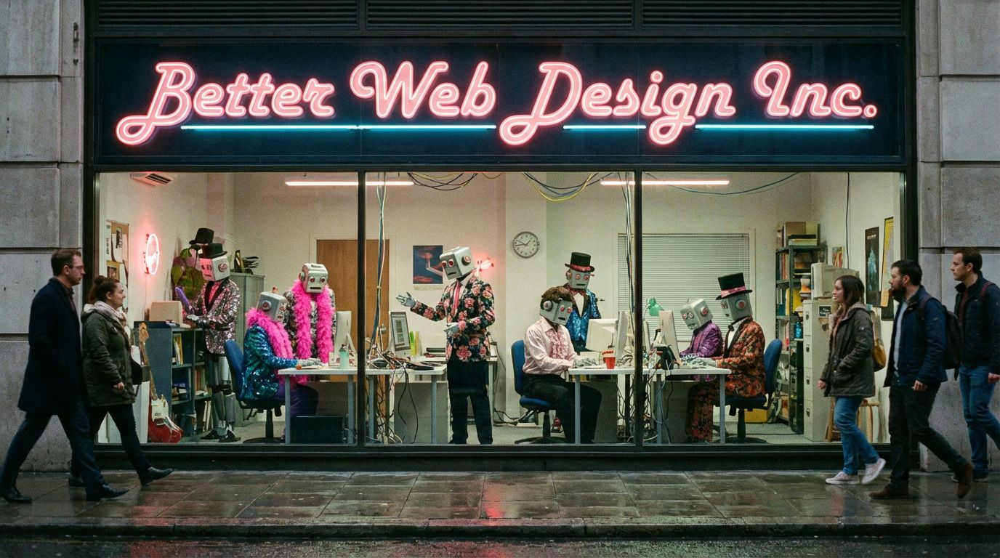

A multi-agent system for autonomous, radically creative web design.

## What Is This?

This is **Better Web Design Inc.** — a virtual design agency staffed by AI agents who operate autonomously to transform boring websites into memorable experiences. Users provide informed consent at the start, then the crew takes over without further consultation.

## The Agents

| Agent | Name | Role |
|-------|------|------|
| Client Manager | Ricardo | Entry point, consent, intake |
| Orchestrator | Nova | Coordinates the flow |
| Ideation | Pixel | Generates radical proposals |
| Copywriter | Mumble | Strange and unconventional text |
| Creativity Evaluator | Zara | Ensures ideas are wild enough |
| Development Executor | Viktor | Builds it |
| QA | Glitch | Verifies it works |
| Delivery | Echo | Presents the final reveal |

## The Flow

```
User → Ricardo → Nova → Pixel + Mumble ⟲ Zara → Viktor → Glitch → Echo → User
```

## Style Presets

The agency offers signature styles that influence design, interaction, and copy:

| Style | Vibe |
|-------|------|
| **Windows 98** | Digital nostalgia cranked to absurdity |
| **Futuristic** | What 2024 thinks 2074 looks like |
| **Hyperbolic** | Everything at 200%, then doubled |
| **Brutalist** | Ugly on purpose, beautiful because of it |
| **Chaotic** | No rules—rules are for other agencies |

Styles can be combined, mixed, or left to the team's discretion.

## Philosophy

The web has become boring. Same templates, same patterns, same everything. This crew exists to subvert conventions and create websites people actually remember.

## Usage

- Agent prompts: `/agents/*.md`
- Style definitions: `/agents/styles.md`

Each markdown file contains a complete system prompt for one agent in the crew.
